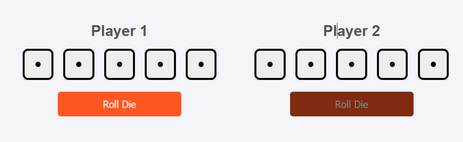
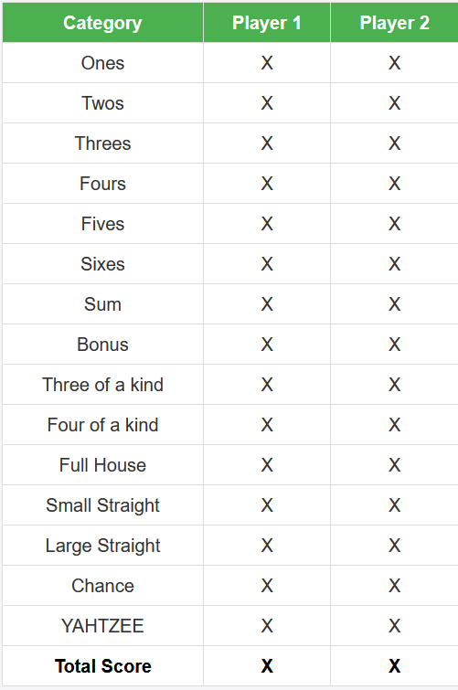

# Local 2 Player Yatzy Game

## 🚀 Overview
This repository contains a Yatzy game implemented in HTML, CSS, and JavaScript. The game simulates the classic dice game "Yatzy," where players roll dice to achieve specific combinations for points. This **Yatzy game** with server-side logic is implemented using Node.js and Express. It demonstrates my skills in back-end development, game state management, and API integration.

## 🛠️ Features
- Server-side game logic for managing multiple player states.
- API integration for communicating game updates to the server.
- Client-side interface for user-friendly gameplay.

## 🔧 Installation & Usage

### Prerequisites
- [Install Node.js, npm & MySQL]

### Setup Instructions
1. Download the files from the repository
2. UnZip the file
3. Open Yatzy.Html
4. Open your Terminal and navigate to the yatzy folder .js using `cd `insert your path here`\Yatzy `
5. Execute `node YatzyServer.js` in the terminal
6. Play the game using the Game Play Instructions below in the Yatzy.Html tab

## Game Play Instructions
1. **Objective**: Roll dice to score the highest points by matching dice combinations like pairs, triples, straights, and more.
2. **Rolling Dice**: Use the "Roll" button to roll five dice.
3. **Freezing Dice**: Click on dice to "freeze" them. Frozen dice will not be re-rolled.
4. **Scoring**: Select a scoring category from the scoreboard for each turn. Scoring categories include Three of a Kind, Four of a Kind, Full House, Small Straight, Large Straight, Yatzy (all dice match), and Chance (total of all dice).

The game follows traditional Yatzy rules, with 13 rounds and one score selected per turn.

## Design Elements
- **HTML**: The HTML file (`Yazty.html`) structures the game layout, including the dice display, roll button, and scoreboard.
- **CSS**: Styling in `Style.css` gives the game a clean, accessible appearance, with frozen dice highlighted to indicate they won’t re-roll.
- **JavaScript Modules**:
  - `Dice.js` manages individual dice roll behaviour.
  - `FreezeDie.js` handles freezing and unfreezing dice.
  - `RollButton.js` controls the dice roll mechanics.
  - `ScoreBoardButtons.js` enables interaction with scoring options.
  - `YatzyEngine.js` and `YatzyGameModule.js` manage the game logic, including scoring, turn progression, and endgame conditions.

## Mockups
- **Header**: The game header, shown below, displays "Yahtzee Game" on a bright green background. This area includes options for starting a "New Game" and viewing the "Rules," ensuring players have quick access to essential functions.

- **Game Layout**: In the gamespace each player has their section labelled by "Player 1" and "Player 2." Five dice are displayed in a row under each player's name, showing the current roll result. Each player also has a "Roll Die" button—Player 1’s is orange, while Player 2’s is a muted brown to visually distinguish between player turns.

- **Scoreboard**: The scoreboard, illustrated below, lists the scoring categories in a green table with columns for each player. Each row shows the possible scoring categories, such as Ones, Twos, Three of a Kind, and so forth. At the bottom, there is a "Total Score" row where each player's cumulative score is displayed, making it easy to track progress.

## 👤 Author
- Name: Thomas Lawrence
- Email: [ThomasLawrence642@gmail.com](mailto:thomaslawrence642@gmail.com)
- LinkedIn: [www.linkedin.com/in/tthomas-lawrence](www.linkedin.com/in/tthomas-lawrence)
